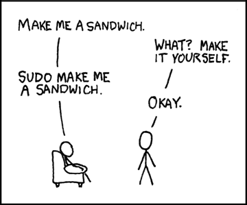

# Unix Handbook <!-- omit in toc -->

## Table of Contents <!-- omit in toc -->

- [References](#references)
- [What is Unix?](#what-is-unix)
- [What is Linux?](#what-is-linux)
- [Unix Architecture](#unix-architecture)
- [Unix Philosophy](#unix-philosophy)
- [Shell](#shell)
  - [What is a shell?](#what-is-a-shell)
  - [Shell Prompt](#shell-prompt)
- [Basic Command Line Editing](#basic-command-line-editing)
- [Sudo](#sudo)
- [System Bootup](#system-bootup)
  - [Log In](#log-in)
  - [Change password](#change-password)
  - [Who Are You?](#who-are-you)
  - [Who is Logged in?](#who-is-logged-in)
  - [Log Out](#log-out)
  - [Shutdown](#shutdown)
- [File Management](#file-management)
  - [Listing Files](#listing-files)
  - [Metacharacters](#metacharacters)
  - [Write & Edit Files](#write--edit-files)
  - [Display Content of a File](#display-content-of-a-file)
  - [Counting Words in a File](#counting-words-in-a-file)
  - [Copying Files](#copying-files)
  - [Renaming Files](#renaming-files)
  - [Delete Files](#delete-files)
- [Other commands](#other-commands)
  - [Date & Time](#date--time)

## References

- <https://shell.cyberciti.biz/guide/Main_Page>
- <https://www.tutorialspoint.com/unix/index.htm>
- <https://ipwithease.com/linux-vs-unix/>
- <https://acloudguru.com/blog/engineering/linux-commands-for-beginners-sudo>

## What is Unix?

The Unix operating system is a set of programs that act as a link between the computer and the user.

The computer programs that allocate the system resources and coordinate all the details of the computer's internals is called the operating system or the kernel.

Users communicate with the kernel through a program known as the shell. The shell is a command line interpreter; it translates commands entered by the user and converts them into a language that is understood by the kernel.

## What is Linux?

Linux is a free open-source operating system based on Unix. Linus Torvalds originally created Linux with the assistance of developers from around the world. Linux is:

- Free
- Unix Like
- Open Source
- Network operating system

| Parameter | Linux | Unix |
|---|---|---|
| Inception Year | 1991 | 1969 |
| Standard | Open source operating system which is freely available | Operating system can only be used by its copywriters |
| System type | Just the kernel | Complete Operating system |
| Target use | Can be used by anyone including home user and developer | Developed mainly for servers, workstations and mainframes |
| Cost | LINUX is freely available and distributed with no associated cost | UNIX variants come as customized cost |
| Security | 60-100 viruses listed till date | 85-120 viruses listed till date |
| Interface type | Primarily uses GUI with option of CLI | Primarily uses CLI |
| Portability | Portable | Not portable |
| Variants | Ubuntu, RedHat, Solaris, OpenSuse, etc. | AIS, HP-UX, BSD, etc. |
| Source | Available in general public | Not available in general public |

## Unix Architecture

Here is a basic block diagram of a Unix system −


The main concept that unites all the versions of Unix is the following four basics −

- **Kernel** − The kernel is the heart of the operating system. It interacts with the hardware and most of the tasks like memory management, task scheduling and file management.

- **Shell** − The shell is the utility that processes your requests. When you type in a command at your terminal, the shell interprets the command and calls the program that you want. The shell uses standard syntax for all commands. C Shell, Bourne Shell and Korn Shell are the most famous shells which are available with most of the Unix variants.

- **Commands and Utilities** − There are various commands and utilities which you can make use of in your day to day activities. `cp`, `mv`, `cat` and `grep`, etc. are few examples of commands and utilities. There are over 250 standard commands plus numerous others provided through 3rd party software. All the commands come along with various options.

- **Files and Directories** − All the data of Unix is organized into files. All files are then organized into directories. These directories are further organized into a tree-like structure called the filesystem.

## Unix Philosophy

The Unix philosophy is philosophical approaches to developing software based on the experience of leading developers of the Unix operating system. The following philosophical approaches also applies to Linux operating systems.

- Do one thing and do it well - Write programs that do one thing and do it well. Write programs to work together. Write programs to handle text streams, because that is a universal interface.
- Everything is file - Ease of use and security is offered by treating hardware as a file.
- Small is beautiful.
- Store data and configuration in flat text files - Text file is a universal interface. Easy to create, backup and move to another system.
- Use shell scripts to increase leverage and portability - Use shell script to automate common tasks across various UNIX / - Linux installations.
- Chain programs together to complete complex task - Use shell pipes and filters to chain small utilities that perform one task at time.
- Choose portability over efficiency.
- Keep it Simple, Stupid (KISS).

## Shell

Computers understand the language of zeros and ones known as binary language. The shell accepts human readable commands and translates them into something the kernel can read and process.

### What is a shell?

- The shell is a user program or it is an environment provided for user interaction.
- It is a command language interpreter that executes commands read from the standard input device such as keyboard or from a file.
- The shell gets started when you log in or open a console (terminal).
- Quick and dirty way to execute utilities.
- The shell is not part of system kernel, but uses the system kernel to execute programs, create files etc.
- Several shells are available for Linux including:
  - The Bourne Shell
  - The C Shell
  - The Korn Shell
  - The GNU Bourne-Again Shell

### Shell Prompt

There are various ways to get shell access:

- **Terminal** - Linux desktop provide a GUI based login system. Once logged in you can gain access to a shell by running X Terminal (XTerm), Gnome Terminal (GTerm), or KDE Terminal (KTerm) application.
- **Connect via secure shell (SSH)** - You will get a shell prompt as soon as you log in into remote server or workstation.
- **Use the console** - A few Linux system also provides a text-based login system. Generally you get a shell prompt as soon as you log in to the system.

## Basic Command Line Editing

- `CTRL + L`: Clear the screen.
- `CTRL + W`: Delete the word starting at cursor.
- `CTRL + U`: Clear the line i.e. Delete all words from command line.
- `Up and Down arrow keys`: Recall commands.
- `Tab`: Auto-complete files, directory, command names and much more.
- `CTRL + R`: Search through previously used commands.
- `CTRL + C`: Cancel currently running commands.
- `CTRL + T`: Swap the last two characters before the cursor.
- `ALT + T`: Swap the last two words before the cursor.
- `CTRL + H`: Delete the letter at cursor.

## Sudo

`Sudo`, the one command to rule them all. It stands for “super user do!” and is pronounced like “sue dough”.

If you prefix `sudo` with any Linux command, it will run that command with elevated privileges. Elevated privileges are required to perform certain administrative tasks.

```shell
sudo your_command
```



## System Bootup

If you have a computer which has the Unix operating system installed in it, then you simply need to turn on the system to make it live.

As soon as you turn on the system, it starts booting up and finally it prompts you to log into the system, which is an activity to log into the system and use it for your day-to-day activities.

### Log In

When you first connect to a Unix system, you usually see a prompt such as the following −

```shell
login:
```

- Have your userid (user identification) and password ready. Contact your system administrator if you don't have these yet.
- Type your userid at the login prompt, then press ENTER. Your userid is case-sensitive, so be sure you type it exactly as your system administrator has instructed.
- Type your password at the password prompt, then press ENTER. Your password is also case-sensitive.
- If you provide the correct userid and password, then you will be allowed to enter into the system. Read the information and messages that comes up on the screen, which is as follows.

```shell
login: dev.tronghieu
dev.tronghieu's password: 
Last login: Wed July 20 14:35:35 2022 from 10.124.5.160
```

### Change password

```shell
passwd
```

### Who Are You?

```shell
whoami   # List the account name associated with the current login
```

### Who is Logged in?

```shell
users    # Print the usernames of users currently logged in
who      # Show who is logged on
w        # Show who is logged on and what they are doing
```

### Log Out

```shell
logout
```

### Shutdown

```shell
halt     # Brings the system down immediately
init 0   # Powers off the system using predefined scripts to synchronize and clean up the system prior to shutting down
init 6   # Reboots the system by shutting it down completely and then restarting it
poweroff # Shuts down the system by powering off
reboot   # Reboots the system
shutdown # Shuts down the system
```

## File Management

All data in Unix is organized into files. All files are organized into directories. These directories are organized into a tree-like structure called the filesystem.

### Listing Files

```shell
ls
ls -l
ls -a
ls -la
```

In the `ls -l` listing example, every file line begins with a `d`, `-`. These characters indicate the type of the file that's listed.

| Prefix | Description |
| - | - |
| - | Regular file, such as an ASCII text file, binary executable, or hard link. |
| d | Directory file that contains a listing of other files and directories. |

### Metacharacters

Metacharacters have a special meaning in Unix. For example, `*` and `?` are metacharacters. We use `*` to match 0 or more characters, a question mark `?` matches with a single character.

For Example −

```shell
ls ch*.doc
```

Displays all the files, the names of which start with `ch` and end with `.doc` −

```shell
ch01-1.doc   ch010.doc   ch02.doc   ch03-2.doc 
ch04-1.doc   ch040.doc   ch05.doc   ch06-2.doc
```

### Write & Edit Files

Check out this video of Fireship: <https://www.youtube.com/watch?v=-txKSRn0qeA>

```shell
vi filename
```

### Display Content of a File

```shell
cat filename      # Concatenate files and print on the standard output
cat -b filename   # Display with the line numbers
```

### Counting Words in a File

```shell
wc filename
# 9 46 168 filename
```

Here is the detail of all the four columns −

- First Column − Represents the total number of lines in the file.
- Second Column − Represents the total number of words in the file.
- Third Column − Represents the total number of bytes in the file. This is the actual size of the file.
- Fourth Column − Represents the file name.

### Copying Files

```shell
cp source_file destination_file
```

### Renaming Files

```shell
mv old_file new_file
```

### Delete Files

```shell
rm filename
rm filename1 filename2 filename3  # remove multiple files
```

## Other commands

### Date & Time

```shell
cal      # Display a calendar
date     # Display the current date
```
