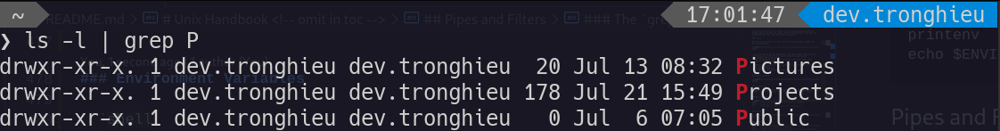

# Unix Handbook <!-- omit in toc -->

## Table of Contents <!-- omit in toc -->

- [References](#references)
- [What is Unix?](#what-is-unix)
- [What is Linux?](#what-is-linux)
- [Unix Architecture](#unix-architecture)
- [Unix Philosophy](#unix-philosophy)
- [Shell](#shell)
- [Basic Command Line Editing](#basic-command-line-editing)
- [Sudo](#sudo)
- [System Bootup](#system-bootup)
  - [Log In](#log-in)
  - [Change password](#change-password)
  - [Who Are You?](#who-are-you)
  - [Date & Time](#date--time)
  - [Who is Logged in?](#who-is-logged-in)
  - [Log Out](#log-out)
  - [Shutdown](#shutdown)
- [File Management](#file-management)
  - [Listing Files](#listing-files)
  - [Metacharacters](#metacharacters)
  - [Write & Edit Files](#write--edit-files)
  - [Display Content of a File](#display-content-of-a-file)
  - [Counting Words in a File](#counting-words-in-a-file)
  - [Copying Files](#copying-files)
  - [Renaming Files](#renaming-files)
  - [Delete Files](#delete-files)
- [Directories](#directories)
  - [Print the Current Directory](#print-the-current-directory)
  - [The directories . (dot) and .. (dot dot)](#the-directories--dot-and--dot-dot)
  - [Absolute path & Relative path](#absolute-path--relative-path)
  - [Change directory](#change-directory)
  - [Create directory](#create-directory)
  - [Remove empty directory](#remove-empty-directory)
  - [Remove non-empty directory](#remove-non-empty-directory)
  - [Rename directory](#rename-directory)
- [File Permission](#file-permission)
  - [The Permission Indicators](#the-permission-indicators)
  - [Access Modes](#access-modes)
  - [Change Permissions](#change-permissions)
    - [Symbolic Mode](#symbolic-mode)
    - [Absolute Mode](#absolute-mode)
- [Environment](#environment)
  - [The .profile File](#the-profile-file)
  - [Setting the PATH](#setting-the-path)
  - [Environment Variables](#environment-variables)
- [Pipes and Filters](#pipes-and-filters)
  - [The `grep` command](#the-grep-command)
  - [The `sort` command](#the-sort-command)
- [Processes Management](#processes-management)
  - [Starting a Process](#starting-a-process)
    - [Foreground Processes](#foreground-processes)
    - [Background Processes](#background-processes)
  - [Listing Running Processes](#listing-running-processes)
  - [Stopping Processes](#stopping-processes)
- [Communication](#communication)
  - [Ping](#ping)
  - [FTP](#ftp)
  - [Telnet](#telnet)

## References

- <https://www.tutorialspoint.com/unix/index.htm>
- <https://shell.cyberciti.biz/guide/Main_Page>
- <https://ipwithease.com/linux-vs-unix/>
- <https://acloudguru.com/blog/engineering/linux-commands-for-beginners-sudo>
- <https://networkencyclopedia.com/absolute-path/>
- <https://www.baeldung.com/linux/path-variable>

## What is Unix?

The Unix operating system is a set of programs that act as a link between the computer and the user.

The computer programs that allocate the system resources and coordinate all the details of the computer's internals is called the operating system or the kernel.

Users communicate with the kernel through a program known as the shell. The shell is a command line interpreter; it translates commands entered by the user and converts them into a language that is understood by the kernel.

## What is Linux?

Linux is a free open-source operating system based on Unix. Linus Torvalds originally created Linux with the assistance of developers from around the world. Linux is:

- Free
- Unix Like
- Open Source
- Network operating system

| Parameter | Linux | Unix |
|---|---|---|
| Inception Year | 1991 | 1969 |
| Standard | Open source operating system which is freely available | Operating system can only be used by its copywriters |
| System type | Just the kernel | Complete Operating system |
| Target use | Can be used by anyone including home user and developer | Developed mainly for servers, workstations and mainframes |
| Cost | LINUX is freely available and distributed with no associated cost | UNIX variants come as customized cost |
| Security | 60-100 viruses listed till date | 85-120 viruses listed till date |
| Interface type | Primarily uses GUI with option of CLI | Primarily uses CLI |
| Portability | Portable | Not portable |
| Variants | Ubuntu, RedHat, Solaris, OpenSuse, etc. | AIS, HP-UX, BSD, etc. |
| Source | Available in general public | Not available in general public |

## Unix Architecture

Here is a basic block diagram of a Unix system −


The main concept that unites all the versions of Unix is the following four basics −

- **Kernel** − The kernel is the heart of the operating system. It interacts with the hardware and most of the tasks like memory management, task scheduling and file management.

- **Shell** − The shell is the utility that processes your requests. When you type in a command at your terminal, the shell interprets the command and calls the program that you want. The shell uses standard syntax for all commands. C Shell, Bourne Shell and Korn Shell are the most famous shells which are available with most of the Unix variants.

- **Commands and Utilities** − There are various commands and utilities which you can make use of in your day to day activities. `cp`, `mv`, `cat` and `grep`, etc. are few examples of commands and utilities. There are over 250 standard commands plus numerous others provided through 3rd party software. All the commands come along with various options.

- **Files and Directories** − All the data of Unix is organized into files. All files are then organized into directories. These directories are further organized into a tree-like structure called the filesystem.

## Unix Philosophy

The Unix philosophy is philosophical approaches to developing software based on the experience of leading developers of the Unix operating system. The following philosophical approaches also applies to Linux operating systems.

- Do one thing and do it well - Write programs that do one thing and do it well. Write programs to work together. Write programs to handle text streams, because that is a universal interface.
- Everything is file - Ease of use and security is offered by treating hardware as a file.
- Small is beautiful.
- Store data and configuration in flat text files - Text file is a universal interface. Easy to create, backup and move to another system.
- Use shell scripts to increase leverage and portability - Use shell script to automate common tasks across various UNIX / - Linux installations.
- Chain programs together to complete complex task - Use shell pipes and filters to chain small utilities that perform one task at time.
- Choose portability over efficiency.
- Keep it Simple, Stupid (KISS).

## Shell

Computers understand the language of zeros and ones known as binary language. The shell accepts human readable commands and translates them into something the kernel can read and process.

- The shell is a user program or it is an environment provided for user interaction.
- It is a command language interpreter that executes commands read from the standard input device such as keyboard or from a file.
- The shell gets started when you log in or open a console (terminal).
- Quick and dirty way to execute utilities.
- The shell is not part of system kernel, but uses the system kernel to execute programs, create files etc.
- Several shells are available for Linux including: Bourne Shell, C Shell, Korn Shell, GNU Bourne-Again Shell

## Basic Command Line Editing

- `CTRL + L`: Clear the screen.
- `CTRL + W`: Delete the word starting at cursor.
- `CTRL + U`: Clear the line i.e. Delete all words from command line.
- `Up and Down arrow keys`: Recall commands.
- `Tab`: Auto-complete files, directory, command names and much more.
- `CTRL + R`: Search through previously used commands.
- `CTRL + C`: Cancel currently running commands.
- `CTRL + T`: Swap the last two characters before the cursor.
- `ALT + T`: Swap the last two words before the cursor.
- `CTRL + H`: Delete the letter at cursor.

## Sudo

`Sudo`, the one command to rule them all. It stands for “super user do!” and is pronounced like “sue dough”.

If you prefix `sudo` with any Linux command, it will run that command with elevated privileges. Elevated privileges are required to perform certain administrative tasks.

```shell
sudo your_command
```


## System Bootup

If you have a computer which has the Unix operating system installed in it, then you simply need to turn on the system to make it live.

As soon as you turn on the system, it starts booting up and finally it prompts you to log into the system, which is an activity to log into the system and use it for your day-to-day activities.

### Log In

When you first connect to a Unix system, you usually see a prompt such as the following −

```shell
login:
```

- Type your userid at the login prompt, then press ENTER. Your userid is case-sensitive, so be sure you type it exactly as your system administrator has instructed.
- Type your password at the password prompt, then press ENTER. Your password is also case-sensitive.

```shell
login: dev.tronghieu
dev.tronghieu's password: 
Last login: Wed July 20 14:35:35 2022 from 10.124.5.160
```

### Change password

```shell
passwd
```

### Who Are You?

```shell
whoami   # List the account name associated with the current login
```

### Date & Time

```shell
cal      # Display a calendar
date     # Display the current date
```

### Who is Logged in?

```shell
users    # Print the usernames of users currently logged in
who      # Show who is logged on
w        # Show who is logged on and what they are doing
```

### Log Out

```shell
logout
```

### Shutdown

```shell
halt     # Brings the system down immediately
init 0   # Powers off the system using predefined scripts to synchronize and clean up the system prior to shutting down
init 6   # Reboots the system by shutting it down completely and then restarting it
poweroff # Shuts down the system by powering off
reboot   # Reboots the system
shutdown # Shuts down the system
```

## File Management

All data in Unix is organized into files. All files are organized into directories. These directories are organized into a tree-like structure called the filesystem.

### Listing Files

```shell
ls       # List directory contents
ls -l    # Use a long listing format
ls -a    # Do not ignore entries starting with .
ls -la   # Combine -l and -a
```

In the `ls -l` listing example, every file line begins with a `d`, `-`. These characters indicate the type of the file that's listed.

| Prefix | Description |
| - | - |
| - | Regular file, such as an ASCII text file, binary executable, or hard link. |
| d | Directory file that contains a listing of other files and directories. |

### Metacharacters

Metacharacters have a special meaning in Unix. For example, `*` and `?` are metacharacters. We use `*` to match 0 or more characters, a question mark `?` matches with a single character.

For Example −

```shell
ls ch*.doc
```

Displays all the files, the names of which start with `ch` and end with `.doc` −

```shell
ch01-1.doc   ch010.doc   ch02.doc   ch03-2.doc 
ch04-1.doc   ch040.doc   ch05.doc   ch06-2.doc
```

### Write & Edit Files

Check out this video of Fireship: <https://www.youtube.com/watch?v=-txKSRn0qeA>

```shell
touch filename    # Create a new file
vi filename       # Open a file for editing, create a new file if it doesn't exist
```

### Display Content of a File

```shell
cat filename      # Concatenate files and print on the standard output
cat -b filename   # Display with the line numbers
```

### Counting Words in a File

```shell
wc filename
# 9 46 168 filename
```

Here is the detail of all the four columns −

- First Column − Represents the total number of lines in the file.
- Second Column − Represents the total number of words in the file.
- Third Column − Represents the total number of bytes in the file. This is the actual size of the file.
- Fourth Column − Represents the file name.

### Copying Files

```shell
cp source_file destination_file
```

### Renaming Files

```shell
mv old_file new_file
```

### Delete Files

```shell
rm filename
rm filename1 filename2 filename3  # Remove multiple files
```

## Directories

### Print the Current Directory

```shell
pwd
```

### The directories . (dot) and .. (dot dot)

The **filename `.` (dot)** represents the current working directory; and the **filename `..` (dot dot)** represents the directory one level above the current working directory, often referred to as the parent directory.

### Absolute path & Relative path


### Change directory

```shell
cd dirname
cd ..           # Go to parent dir
cd ../..        # Go to grand-parent dir
cd ~            # Go to home
cd -            # Go to previous dir
```

### Create directory

```shell
mkdir dirname
```

### Remove empty directory

```shell
rmdir dirname
```

### Remove non-empty directory

```shell
rm -rf dirname
# Flag -r: recursive - remove directories and their contents recursively
# Flag -f: force - remove directories and their contents recursively
```

### Rename directory

```shell
mv old_dir new_dir
```

## File Permission

Every file in Unix has the following attributes −

- **Owner permissions** − The owner's permissions determine what actions the owner of the file can perform on the file.

- **Group permissions** − The group's permissions determine what actions a user, who is a member of the group that a file belongs to, can perform on the file.

- **Other (world) permissions** − The permissions for others indicate what action all other users can perform on the file.

### The Permission Indicators

While using ls -l command, it displays various information related to file permission as follows −

```shell
ls -l
# drwxr-xr-x. 1 dev.tronghieu dev.tronghieu   122 Jul 21 13:56 images
# -rw-r--r--. 1 dev.tronghieu dev.tronghieu 13418 Jul 21 14:14 README.md
```

The first column represents different access modes, `d` means directory and `-` means regular file.

The permissions are broken into groups of threes, and each position in the group denotes a specific permission, in this order: read (r), write (w), execute (x) −

- The first three characters **(2-4)** represent the permissions for the file's owner. For example, `drwxr-xr-x.` represents that the owner has **read (r)**, **write (w)** and **execute (x)** permission.

- The second group of three characters **(5-7)** consists of the permissions for the group to which the file belongs. For example, `drwxr-xr-x.` represents that the group has **read (r)** and **execute (x)** permission, but no write permission.

- The last group of three characters **(8-10)** represents the permissions for everyone else. For example, `drwxr-xr-x.` represents that there are **read (r)** and **execute (x)** permissions.

### Access Modes

| Mode | File | Directory |
| - | - | - |
| **Read** | Grants the capability to read, i.e., view the contents of the file. | Access to a directory means that the user can read the contents. The user can look at the filenames inside the directory. |
| **Write** | Grants the capability to modify, or remove the content of the file. | Access means that the user can add or delete files from the directory. |
| **Execute** | User with execute permissions can run a file as a program. | Executing a directory doesn't really make sense, so think of this as a traverse permission. |

### Change Permissions

#### Symbolic Mode

```shell
chmod u+rwx,g=x,o-r test.txt
# From -rw-r--r--.
# To   -rwx--x---.
```

#### Absolute Mode

Each permission is assigned a value, as the following table shows, and the total of each set of permissions provides a number for that set.

| Number | Permission | Ref |
| - | - | - |
| 0 | No permission | --- |
| 1 | Execute permission | --x |
| 2 | Write permission | -w- |
| 3 | Execute and write permission: 1 (execute) + 2 (write) = 3 | -wx |
| 4 | Read permission | r-- |
| 5 | Read and execute permission: 4 (read) + 1 (execute) = 5 | r-x |
| 6 | Read and write permission: 4 (read) + 2 (write) = 6 | rw- |
| 7 | Read, write and execute permission: 4 (read) + 2 (write) + 1 (execute) = 7 | rwx |

```shell
chmod 755 test.txt
# From -rw-r--r--.
# To   -rwxr-xr-x.
```

## Environment

When you log in to the system, the shell undergoes a phase called **initialization** to set up the environment. This is usually a two-step process that involves the shell reading the following files −

- /etc/profile
- .profile

The process is as follows −

- The shell checks to see whether the file `/etc/profile` exists.
- If it exists, the shell reads it. Otherwise, this file is skipped. No error message is displayed.
- The shell checks to see whether the file `.profile` exists in your home directory. Your home directory is the directory that you start out in after you log in.
- If it exists, the shell reads it; otherwise, the shell skips it. No error message is displayed.

**Note** − The shell initialization process detailed here applies to all Bourne type shells, but some additional files are used by **bash** and **ksh**.

### The .profile File

The file `/etc/profile` is maintained by the system administrator of your Unix machine and contains shell initialization information required by all users on a system.

The file `.profile` is under your control. You can add as much shell customization information as you want to this file. The minimum set of information that you need to configure includes −

- The type of terminal you are using.
- A list of directories in which to locate the commands.
- A list of variables affecting the look and feel of your terminal.

### Setting the PATH

When you type any command on the command prompt, the shell has to locate the command before it can be executed.

The `PATH` variable specifies the locations in which the shell should look for commands.

```shell
echo $PATH
# /usr/local/bin:/usr/local/sbin:/usr/bin:/usr/sbin
```

Here, each of the individual entries separated by the colon character `:` are directories. If you request the shell to execute a command and it cannot find it in any of the directories given in the PATH variable, a message `not found` appears.

We add our export command to the end of `~/.profile`. If the `~/.profile` file doesn’t exist, we should create it using the touch command:

```shell
touch ~/.profile
```

Then we can add our `export` command to `~/.profile`.

```shell
export PATH=/some/new/path        # Re-assign
export PATH=/some/new/path:$PATH  # Prepend
export PATH=$PATH:/some/new/path  # Append
```

Additionally, we need to open a new shell, or source our `~/.profile` file to reflect the change. We’d execute:

```shell
. ~/.profile
source ~/.profile  # Bash
```

### Environment Variables

```shell
printenv
echo $ENVIRONMENT_VARIABLE  # e.g. echo $PATH
```

## Pipes and Filters

To make a pipe, put a vertical bar `|` on the command line between two commands.

When a program takes its input from another program, it performs some operation on that input, and writes the result to the standard output. It is referred to as a **filter**.

### The `grep` command

The name `grep` comes from the ed (a Unix line editor) command `g/re/p` which means “globally search for a regular expression and print all lines containing it”.

A regular expression is either some plain text (a word, for example) and/or special characters used for pattern matching.



There are various options which you can use along with the grep command −

| Option | Description |
| - | - |
| -v | Prints all lines that do not match pattern. |
| -n | Prints the matched line and its line number. |
| -i | Case insensitive search. |

### The `sort` command

```shell
sort filename  # Arrange lines of text alphabetically or numerically
```

The `sort` command arranges lines of text alphabetically by default. There are many options that control the sorting −

| Option | Description |
| - | - |
| -f | Sort upper and lowercase together. |
| -n | Sort numerically, ignores blanks and tabs. |
| -r | Reverse the order of the lines. |
| -t | Sort by the time the file was last modified. |
| +x | Ignore first **x** fields when sorting. |

## Processes Management

Whenever you issue a command in Unix, it creates, or starts, a new process. When you tried out the `ls` command to list the directory contents, you started a process. A process, in simple terms, is an instance of a running program.

The operating system tracks processes through a five-digit ID number known as the **pid** or the process ID. Each process in the system has a unique **pid**.

### Starting a Process

#### Foreground Processes

By default, every process that you start runs in the foreground. It gets its input from the keyboard and sends its output to the screen.

The process runs in the foreground, the output is directed to my screen, and if the command wants any input, it waits for it from the keyboard.

While a program is running in the foreground and is time-consuming, no other commands can be run (start any other processes) because the prompt would not be available until the program finishes processing and comes out.

#### Background Processes

A background process runs without being connected to your keyboard. If the background process requires any keyboard input, it waits.

The advantage of running a process in the background is that you can run other commands; you do not have to wait until it completes to start another!

The simplest way to start a background process is to add an ampersand `&` at the end of the command.

```shell
ls -l       # Command is started in the foreground.
ls -l &     # Command is started in the background.
```

### Listing Running Processes

```shell
ps          # List all processes.
ps -f       # List all processes with full information.
```

| Column | Description |
| - | - |
| UID | User ID that this process belongs to (the person running it) |
| PID | Process ID |
| PPID | Parent process ID (the ID of the process that started it) |
| C | CPU utilization of process |
| STIME | Process start time |
| TTY | Terminal that process is running on |
| TIME | Total CPU time consumed by process |
| CMD | Command that process is running |

| Option | Description |
| - | - |
| -a | Shows information about all users |
| -x | Shows information about processes without terminals |
| -u | Shows additional information like -f option |
| -e | Displays extended information |

### Stopping Processes

Ending a process can be done in several different ways.

From a console-based command, sending a `CTRL + C` keystroke (the default interrupt character) will exit the command. This works when the process is running in the foreground mode.

If a process is running in the background, you should get its Job ID using the `ps` command. After that, you can use the kill command to kill the process as follows −

```shell
ps -f
kill pid      # Kill the process with the given pid
kill -9 pid   # Kill the process with the given pid and force it to exit
```

## Communication

### Ping

```shell
ping hostname/ip-address
# ping google.com
# ping 142.250.204.78
```

The above command starts printing a response after every second. To come out of the command, you can terminate it by pressing `CTRL + C` keys.

### FTP

FTP stands for File Transfer Protocol. This utility helps you upload and download your file from one computer to another computer.

```shell
ftp hostname/ip-address
```

| Command | Description |
| - | - |
| `put filename` | Uploads filename from the local machine to the remote machine. |
| `get filename` | Downloads filename from the remote machine to the local machine. |
| `mput file list` | Uploads more than one file from the local machine to the remote machine. |
| `mget file list` | Downloads more than one file from the remote machine to the local machine. |
| `prompt off` | Turns the prompt off. By default, you will receive a prompt to upload or download files using mput or mget commands. |
| `prompt on` | Turns the prompt on. |
| `dir` | Lists all the files available in the current directory of the remote machine. |
| `cd dirname` | Changes the current directory of the remote machine to dirname. |
| `lcd` | Changes the current directory of the local machine to dirname. |
| `quit` | Exits the FTP session. |

### Telnet

**Telnet** is a utility that allows a computer user at one site to make a connection, login and then conduct work on a computer at another site.

```shell
telnet hostname/ip-address
```
